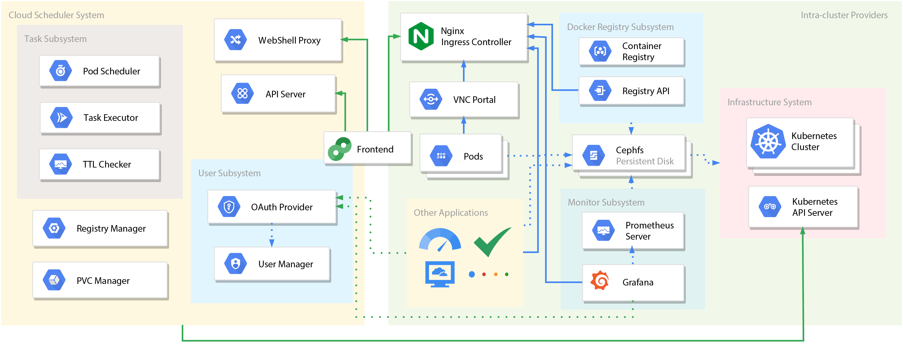
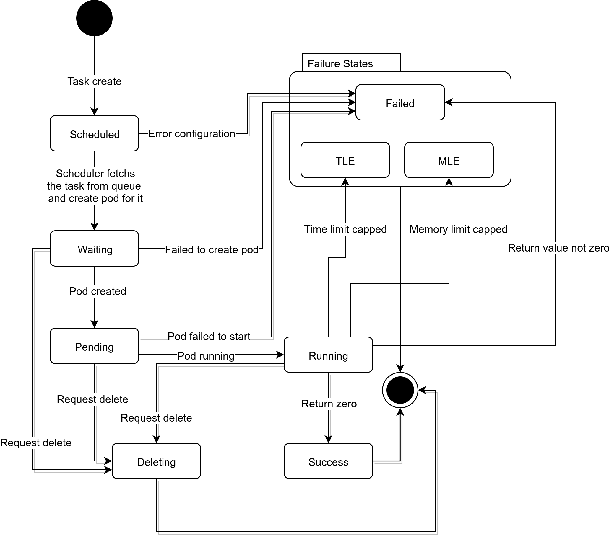

# Welcome to Cloud Scheduler

Cloud scheulder is a cloud task management platform which supports management, monitor and execution of general tasks, such as Online Judge, Web IDE, etc.

## Dependencies
+ frontend
    + [Vue.js](https://vuejs.org/)
+ backend
    + [Django](https://www.djangoproject.com/)
    + MySQL (in production environment)

## System Architecture


The system comprises three major parts, i.e. backend API server, frontend and kubernetes cluster. You can develop your apps based on backend API server. Please see [API Documentation](apidocs.md) for details.


## Performance
Cloud Scheduler consumes the resources of Kubernetes clusters linearly, i.e. $O(n)$, yet the constant term may vary with different settings. Theoretically, pods used for WebShell, WebIDE and task execution are relatively light weight, yielding a lower constant. Pod for VNC will consume more resources such as memory, which is not recommended if your cluster has limited capacity.


## The Finite State Machine for Task Execution
Basically, there are 9 states for tasks:  

+ 0 - Scheduled
+ 1 - Running
+ 2 - Succeeded
+ 3 - Failed
+ 4 - Deleting
+ 5 - Pending
+ 6 - TLE (Time Limit Exceeded)
+ 7 - Waiting
+ 8 - MLE (Memory Limit Exceeded)

The transition diagram of the FSM is as follows  
  
The `Deleting` state is designed to ensure the resources can be unallocated properly. If the task has already been assigned a pod, Cloud Scheduler will first mark it as `Deleting`, request the Kubernetes API, confirm that the resources are deleted, and then the task can be safely evicted. For task that is finished, i.e. `Succeeded` or `Failed`, or is not scheduled a pod, it can be deleted directly.

## User Space

The user space is the place where user task files are stored. In this space, `<user, task>` label is used to identify users and corresponding task.  
When user enters WebIDE/WebShell/VNC for the first time, the user space for that user and task will be automatically created, with all files in `Task Initial File Path` specified by the admin copied into this space.

!!! tip
    The system currently supports the recreation of user space, that is, the user can choose to restore user space via the red `Reset` button in WebIDE. User can decide whether to use the initial files to override files in user space, or purge all files in user space and get a fresh start.


## How Tasks are Executed

Here is a pseudo-code of how tasks are executed:
```pseudocode
func execute_task(task, user):
    user_space = find_user_space(task.uuid, user)  # fetch storage space for <user, task> tuple
    copy_files_in_dir(user_space, task.working_dir)
    copy_files_in_dir(task.script_path, task.working_dir)
    change_current_dir(task.working_dir)
    execute_command(task.commands)
```

!!! warning
    User space is not automatically created. If the user has never entered WebShell/WebIDE/VNC, the user space will be empty. In this case, the task execution may fail owing to the lack of initial task files.

## Extension
More nodes can be added to the Kubernetes cluster, which increases the number of users the cluster can serve. To achieve this, you need to 

+ Add new nodes to the cluster
+ Edit Ceph configurations files and apply the patch. The configurations are those mentioned in [Configure Rook Ceph Cluster](setup.md#configure-rook-ceph-cluster) and [Configure Ceph Shared File System](setup.md#configure-ceph-shared-file-system). You need to modify the number of replicas to fit in your scenario.


## Security

All pods (WebShell) for plain users provide no `root` privilege, and users can only view his/her files. Plus, fork bombs are prevented properly to avoid malliciously draining the resources of the server.

!!! warning
    You can try it out using a WebShell from `Task` page, yet **DO NOT** attempt on WebShell from `Pod` page. The latter one provides `root` privilege, and the prevention mechanism will be invalidated in this mode.  